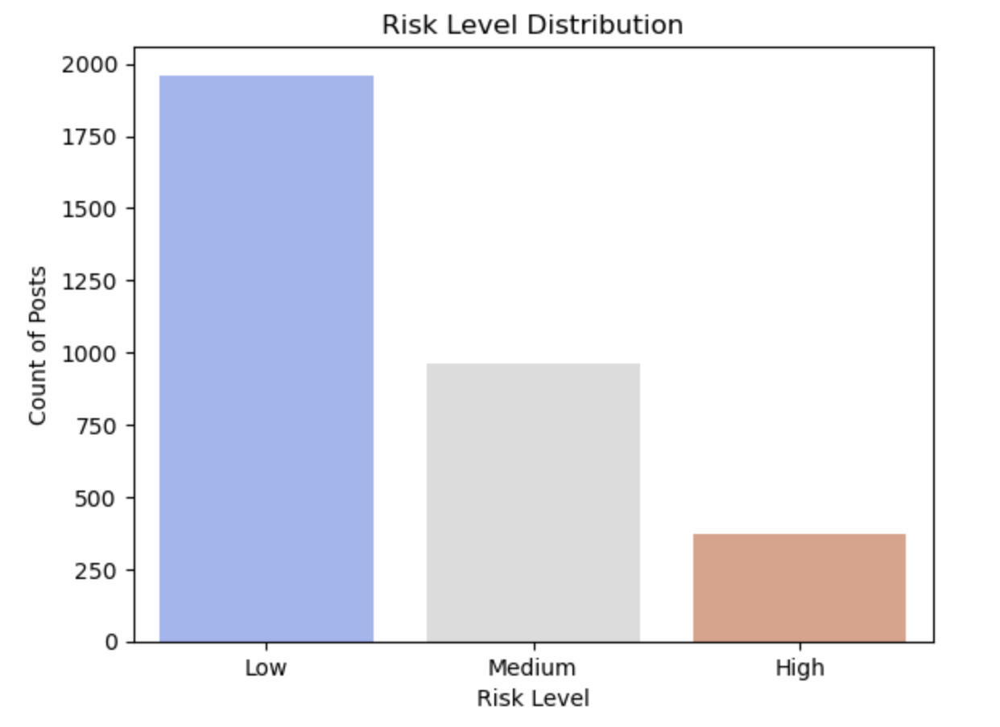

# Leveraging NLP Predictive Models for Suicide Prevention

# Project Overview

This project aims to develop NLP-based predictive models to identify high-risk individuals in online mental health communities, with the goal of contributing to early intervention efforts in suicide prevention. By analyzing linguistic patterns and content in posts from mental health-related subreddits, we aim to build models that can accurately identify individuals expressing suicidal ideation or emotional distress.

# Table of Contents

Project Description

Dataset

Methodology

Setup Instructions

Project Structure

Results

Insights and Implications

Future Work

# Project Description
The project focuses on predicting suicide risk levels using NLP techniques on text data from Reddit posts. By analyzing linguistic patterns and content in these posts, we aim to develop models that can accurately identify individuals expressing suicidal ideation or emotional distress.

# Dataset
The dataset consists of posts from the following subreddits:
Mental health-related subreddits: r/SuicideWatch, r/depression, r/mentalhealth
Neutral/positive subreddits: r/AskReddit, r/movies, r/happy

# Reddit Data Collection Script for Suicide Prediction

To gather data for our suicide prediction project, our team scraped Reddit posts from two types of subreddits: one focused on suicidal thoughts (e.g., r/SuicideWatch) and another with general or positive content (e.g., r/happy). Instead of using Reddit’s official API, which has rate limits, our team used the Pushshift API (https://pushshift.io/), designed for large-scale Reddit data extraction.

We developed a Python script that fetches posts in batches of 100, extracting key fields like title, selftext, score, comments, and timestamp. Posts are labeled as 'suicide' or 'normal' based on their subreddit. To prevent overloading the API, a 1-second delay is included between requests.

The script runs until approximately 100,000 posts from each subreddit are collected, then merges the datasets into a single CSV file. This creates a balanced, high-quality dataset ready for further preprocessing and model training. This automated pipeline allows our team to efficiently build a large-scale dataset without manual effort.

# The dataset includes features such as:

Post text content

Creation timestamp

Engagement metrics (upvotes, comments)

Sentiment scores

Risk level labels (High, Medium, Low)

The cleaned dataset is saved as Cleaned_SuicideWatch_Dataset.csv

# Methodology

# Data Preprocessing

Text Cleaning: Lowercasing, URL removal, punctuation removal, and digit removal.

Label Encoding: Converting text labels (High, Medium, Low) to numeric values.

Feature Engineering: Extracting temporal features (hour, day_of_week) from timestamps.

# Exploratory Data Analysis (EDA)

Distribution of sentiment scores

Risk level distribution

Posting activity by day of the week

Word clouds for high-risk posts

Correlation heatmap between engagement metrics and sentiment

# Modeling

# Traditional Machine Learning Models:

Logistic Regression

Naive Bayes

Support Vector Machines (SVM)

Random Forest

Gradient Boosting

XGBoost

# Ensemble Techniques:

Voting Classifier

Stacking Classifier

Bagging Classifier

Boosting Classifier

# Deep Learning Models:

FullyConnected Neural Network (FCNN)

Convolutional Neural Network (CNN)

Recurrent Neural Network (RNN)

Gated Recurrent Unit (GRU)

Long Short-Term Memory (LSTM)

# Evaluation Metrics

Precision

Recall

F1 Score

# NLP with Imbalanced Data
In natural language processing (NLP) tasks involving imbalanced data, relying solely on accuracy can be misleading. Although accuracy measures overall correctness, it fails to reflect the model’s ability to detect the minority class — the class we usually care most about in sensitive applications like suicide prevention. A model might achieve high accuracy by predominantly predicting the majority class, but this would be ineffective and even dangerous when the minority class contains critical cases.

Instead, precision becomes essential, as it indicates how many of the model’s positive predictions (e.g., identifying high-risk individuals) are actually correct. High precision means fewer false alarms, making the model's alerts more meaningful and trustworthy. On the other hand, recall measures the proportion of actual positive cases the model successfully identifies. In high-stakes contexts like mental health or emergency response, recall is arguably the most critical metric — missing a true high-risk case could have fatal consequences.

The F1 score, which combines precision and recall into a single metric, serves as a balanced measure when both under-alerting and over-alerting must be minimized. It is particularly valuable when there’s a need to maintain sensitivity without triggering an overwhelming number of false positives. Overall, in imbalanced NLP datasets, precision, recall, and F1 score provide a much clearer picture of a model's real-world effectiveness than accuracy alone.

# Best Model for the NLP Suicide Post Prediction Project

# Model: Stacking Classifier

Reason: Stacking Classifier combines the strengths of multiple models (e.g., SVM, LR, GB, DT) with a meta-classifier (e.g., Random Forest), which can enhance model performance and interpretability. It demonstrates robust performance across different risk levels and is particularly effective at handling imbalanced datasets. 
From the results, the Stacking Classifier achieves a testing F1-score of 0.78 for overall risk detection, 0.85 for low risk, 0.80 for medium risk, and 0.96 for high risk. It offers a good balance between performance and computational efficiency, making it suitable for the NLP suicide post prediction task.

# Why Not Other Models?
Deep Learning Models (CNN, LSTM/GRU/RNN): While they are effective at capturing complex text patterns, they are computationally intensive and may be overfit on smaller datasets. Given the potential limitations in computational resources and the need for model interpretability, deep learning models are less suitable in this scenario.

Traditional Models (Logistic Regression, Naive Bayes, SVM, Random Forest, Gradient Boosting): These models offer good performance but may not capture complex text patterns as effectively as ensemble models. For instance, while Random Forest and Gradient Boosting perform well, they do not consistently outperform the Stacking Classifier across all risk levels.

Other Ensemble Models (Voting Classifier, Bagging Classifier, Boosting Classifier): These models also provide strong performance, but the Stacking Classifier demonstrates a slight edge in balancing performance across different risk levels and handling imbalanced datasets.

# The best model for the NLP suicide post prediction project

The Stacking Classifier is chosen as the best model for the NLP suicide post prediction project due to its robust performance, ability to handle imbalanced datasets, and good balance between computational efficiency and model interpretability.

# Insights and Implications

# Key Findings

Model Performance: Ensemble models and certain deep learning architectures (like CNNs) show promising results in identifying high-risk individuals.

Feature Importance: Linguistic features and temporal patterns play a significant role in predicting risk levels.

Sentiment Analysis: Sentiment scores are strongly correlated with risk levels, indicating the importance of emotional tone in posts.

# Practical Implications

Early Intervention: The models can be integrated into mental health platforms to flag high-risk users for immediate attention.

Resource Allocation: Helps mental health professionals prioritize their efforts by identifying individuals most in need.

Community Moderation: Assists moderators in identifying and supporting users in distress within online communities.

# Future Work

Model Deployment: Developing an API to deploy the best-performing models for real-time risk assessment.

User Feedback Loop: Incorporating feedback from mental health professionals to refine model predictions.

Multimodal Analysis: Exploring the integration of text, image, and audio data for a more comprehensive risk assessment.

Ethical Considerations: Developing guidelines for ethical use of predictive models in mental health contexts.

# Link to the Suicide Prevention Risk Predictor
https://capstone-project-umbc-q57vhlkqcobgeawqq6z6xd.streamlit.app/
